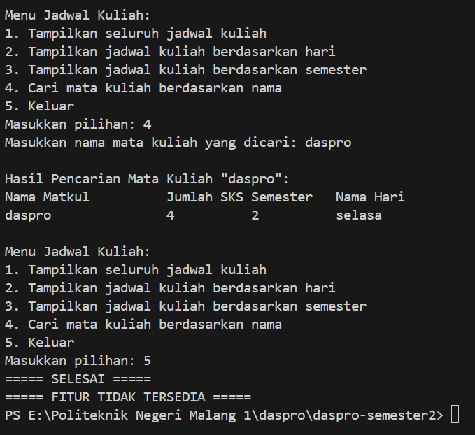

|  | Algorithm and Data Structure |
|--|--|
| NIM |   244107010045|
| Nama |  M.Adhitya Yusuf Al-Ayyubi |
| Kelas | TI - 1H |
| Repository | (https://github.com/Adhityayusuf/daspro-semester2/tree75a2698343655696b9ca9c3a355cb416e075ecd9/pertemuan%201) |

# PERTEMUAN KE SATU

## 1. PEMILIHAN 

The solution is implemented in Pemilihan13.java, and below is screenshot of the result.

**Alur Jalannya Program :**  
Berikut adalah alur singkat program:

1. **Tampilkan Judul**: Menampilkan teks **"Program Menghitung Nilai Akhir"**.
2. **Input Nilai**: Pengguna memasukkan nilai Tugas, Kuis, UTS, dan UAS.
3. **Validasi Nilai**: Jika nilai di luar rentang 0-100, tampilkan **"nilai tidak valid"** dan program berhenti.
4. **Hitung Nilai Akhir**
5. **Tentukan Nilai Huruf**: Berdasarkan nilai akhir, tentukan huruf (A, B+, B, C+, C, D, E).
6. **Tentukan Kelulusan**:  
   - **Lulus** jika huruf: A, B+, B, C+, C.  
   - **Tidak Lulus** jika huruf: D, E.
7. **Tampilkan Hasil**: Cetak nilai akhir, nilai huruf, dan status kelulusan.  

## 2. PERULANGAN

The solution is implemented in Perulangan13.java, and below is screenshot of the result.

**Alur Jalannya Program :**  
Berikut alur singkat program :

1. **Input NIM**: Pengguna memasukkan NIM sebagai **String**.
2. **Ambil Dua Digit Terakhir**: Ekstraksi dua angka terakhir dari NIM dan simpan dalam variabel **`n`**.
3. **Penyesuaian Nilai n**: Jika **`n < 10`**, tambahkan 10 ke nilai **`n`**.
4. **Cetak Nilai n**: Menampilkan nilai **`n`** yang telah disesuaikan.
5. **Perulangan Hingga n**:
   - Jika **`i == 6`** atau **`i == 10`**, lewati iterasi.
   - Jika **`i`** genap, cetak angka **`i`**.
   - Jika **`i`** ganjil, cetak simbol `*`.

## 3. Array  

The solution is implemented in Array13.java, and below is screenshot of the result.    

   

**Alur Jalannya Program :**  
Berikut adalah alur singkat program :

1. **Tampilkan Judul**: Menampilkan **"PROGRAM MENGHITUNG IPK SEMESTER"**.
2. **Input Jumlah Mata Kuliah**: Pengguna memasukkan jumlah mata kuliah.
3. **Deklarasi Array**: Membuat array untuk menyimpan nama mata kuliah, bobot SKS, nilai angka, nilai setara, dan nilai huruf.
4. **Input Data Mata Kuliah**: Untuk setiap mata kuliah, pengguna memasukkan:
   - Nama mata kuliah
   - Bobot SKS
   - Nilai angka
5. **Konversi Nilai Angka ke Huruf dan Setara**:
   - Menentukan nilai huruf dan bobot nilai berdasarkan nilai angka.
6. **Hitung Total SKS dan Total Bobot Nilai**: Mengalikan nilai setara dengan bobot SKS dan menghitung total SKS.
7. **Tampilkan Data Mata Kuliah**: Menampilkan nama mata kuliah, nilai angka, nilai huruf, dan nilai setara.
8. **Hitung dan Cetak IPK Semester**.   

## 4. FUNGSI   

The solution is implemented in Fungsi13.java, and below is screenshot of the result.   

   

**Alur Jalannya Program :**    
Alur singkat program:

1. **Deklarasi Harga Bunga**: Menetapkan harga masing-masing jenis bunga.
2. **Inisialisasi Stock**: Menyimpan data stock bunga untuk 4 cabang RoyalGarden.
3. **Hitung Pendapatan Cabang**:  
   - Fungsi menghitung pendapatan setiap cabang jika semua bunga habis terjual.
   - Menampilkan pendapatan setiap cabang.
4. **Tampilkan Stock Cabang 4**:  
   - Menampilkan stock bunga cabang ke-4 setelah dikurangi bunga mati sesuai jumlah yang ditentukan.
5. **Selesai**: Program berhenti setelah menampilkan semua informasi.   

## TUGAS 1   

The solution is implemented in Tugas1.java, and below is screenshot of the result.   

  

**Alur Jalannya Program :**   
Alur singkat program:

1. **Inisialisasi Data**: Kode plat kendaraan dan nama kota yang sesuai disimpan dalam array.
2. **Input Kode**: Pengguna memasukkan satu karakter kode plat.
3. **Pencarian Kode**: Program mencari kecocokan antara kode yang dimasukkan dan array `kode`.
4. **Output**:  
   - Jika kode cocok, tampilkan nama kota yang sesuai.  
   - Jika tidak cocok, tampilkan "KODE TIDAK ADA".
5. **Selesai**: Program berhenti setelah menampilkan hasil.   

## TUGAS 2   

The solution is implemented in Tugas2.java, and below is screenshot of the result.   

   

**Alur Jalannya Program :**   
Alur singkat program:

1. **Menampilkan Menu**: Program menampilkan pilihan untuk menghitung:
   - Volume kubus
   - Luas permukaan kubus
   - Keliling kubus
   - Berhenti

2. **Input Pilihan**: Pengguna memilih salah satu fitur.

3. **Input Sisi** (jika fitur 1-3 dipilih): Pengguna memasukkan panjang sisi kubus.

4. **Perhitungan**:
   - **Volume**: Menghitung sisi³.
   - **Luas Permukaan**: Menghitung 6 × sisi².
   - **Keliling**: Menghitung 12 × sisi.

5. **Output Hasil**: Menampilkan hasil perhitungan sesuai fitur yang dipilih.

6. **Pengulangan**: Program terus berjalan sampai pengguna memilih opsi "4. Berhenti".   

## TUGAS 3   

The solution is implemented in Tugas3.java, and below is screenshot of the result.    

  

**Alur Jalannya Program :**    
Alur singkat program:

1. **Input Data**:  
   - Meminta jumlah mata kuliah.  
   - Untuk setiap mata kuliah, pengguna memasukkan nama, jumlah SKS, semester, dan hari kuliah.

2. **Menu Utama**: Menyediakan 5 opsi:  
   - **1. Tampilkan seluruh jadwal kuliah**: Menampilkan semua data mata kuliah yang telah diinput.  
   - **2. Tampilkan jadwal berdasarkan hari**: Menampilkan jadwal kuliah sesuai hari yang dimasukkan pengguna.  
   - **3. Tampilkan jadwal berdasarkan semester**: Menampilkan jadwal berdasarkan semester yang dimasukkan.  
   - **4. Cari mata kuliah berdasarkan nama**: Menampilkan detail mata kuliah yang sesuai dengan nama yang dimasukkan.  
   - **5. Keluar**: Mengakhiri program.

3. **Pengulangan**: Program terus menampilkan menu sampai pengguna memilih opsi "5. Keluar".   