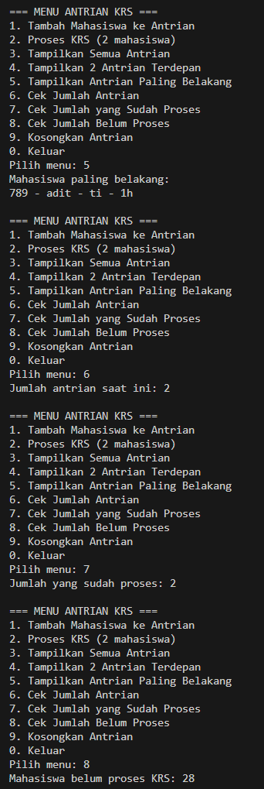

|  | Algorithm and Data Structure |
|--|--|
| NIM |   244107010045|
| Nama |  M.Adhitya Yusuf Al-Ayyubi |
| Kelas | TI - 1H |
| Repository | (https://github.com/Adhityayusuf/daspro-semester2/tree/main/pertemuan%2011)     

# PERTEMUAN KE SEBELAS    

## Percobaan 1 : Operasi Dasar Queue     

The solution is implemented in Queue13.java, and QueueMain.java, and below is screenshot of the result.       

     

Berikut alur program :

1. Program meminta kapasitas queue dari pengguna.
2. Tampilkan menu pilihan (1–5):

   1. Enqueue: Tambahkan data ke belakang queue.
   2. Dequeue: Hapus data dari depan queue.
   3. Print: Tampilkan semua isi queue.
   4. Peek: Tampilkan data paling depan.
   5. Clear: Kosongkan seluruh isi queue.
3. Pengguna memilih menu → sistem menjalankan fungsi sesuai pilihan.
4. Program terus mengulang selama input adalah 1–5.

### PERTANYAAN : 
1. Pada konstruktor, mengapa nilai awal atribut front dan rear bernilai -1, sementara atribut size 
bernilai 0?     
- front = -1 dan rear = -1 digunakan untuk menandai bahwa queue masih kosong dan belum ada elemen dimasukkan.
- size = 0 menunjukkan jumlah elemen saat ini adalah nol.
- -1 dipakai agar mudah dikenali kondisi awal queue, dan nanti diubah ke 0 saat elemen pertama dimasukkan.    
2. jawaban :   
- Jika rear sudah mencapai indeks terakhir (max - 1), maka rear di-set ke 0 agar bisa melingkar kembali ke awal array.
- Tujuannya agar memanfaatkan ruang kosong di depan setelah Dequeue.
3. Jika front sudah sampai di indeks akhir (max - 1), maka front diputar kembali ke awal (0) untuk menyesuaikan dengan array melingkar.
4. Karena data queue dimulai dari front, bukan selalu dari indeks 0.
5. Ini digunakan untuk memutar indeks ke posisi berikutnya secara melingkar.saat i mencapai max - 1, ekspresi ini akan mengembalikan 0 sehingga array bisa terus digunakan secara efisien.
6. kode program :
```
    if (IsFull()) {
        System.out.println("Queue sudah penuh");
    }
```     
7. yang di modifikasi :
```
if (IsFull()) {
            System.out.println("Queue sudah penuh! Program dihentikan.");
            System.exit(1);
        }
```    
```
if (IsEmpty()) {
            System.out.println("Queue kosong! Program dihentikan.");
            System.exit(1);
            return -1;
        }
```    

## Percobaan 2 :  Antrian Layanan Akademik    

The solution is implemented in Mahasiswa.java, AntrianLayanan.java, and LayananAkademikSIAKAD.java, and below is screenshot of the result.    

     
     

Berikut alur jalannya program:

1. Program dimulai dan menampilkan menu pilihan ke pengguna.
2. Pengguna memilih menu:

   * **1**: Memasukkan data mahasiswa, lalu ditambahkan ke antrian.
   * **2**: Mengeluarkan mahasiswa terdepan dari antrian (dilayani).
   * **3**: Menampilkan mahasiswa yang berada di posisi paling depan.
   * **4**: Menampilkan seluruh isi antrian.
   * **5**: Menampilkan jumlah mahasiswa dalam antrian.
   * **0**: Keluar dari program.
3. Program terus berjalan dalam perulangan hingga pengguna memilih **menu 0** (keluar).

### PERTANYAAN :     
1. Lakukan modifikasi program dengan menambahkan method baru bernama LihatAkhir pada class AntrianLayanan yang digunakan untuk mengecek antrian yang berada di posisi belakang. Tambahkan pula daftar menu 6. Cek Antrian paling belakang pada class LayananAkademikSIAKAD sehingga method LihatAkhir dapat dipanggil!        

```
public void lihatAkhir() {
    if (IsEmpty()) {
        System.out.println("Antrian kosong.");
    } else {
        System.out.println("Mahasiswa paling belakang : ");
        System.out.println("NIM - NAMA - PRODI - KELAS");
        data[rear].tampilkanData();
    }
}
```
```
System.out.println("6. Cek Antrian Paling Belakang");
```
```
case 6:
    antrian.lihatAkhir();
    break;
```
     

## TUGAS :   



