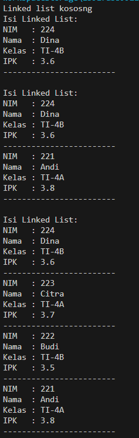
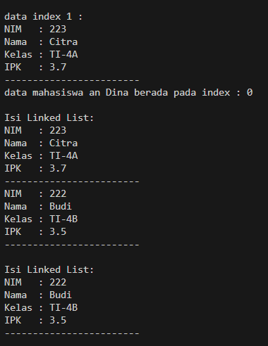
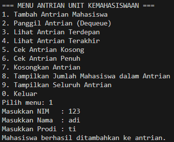
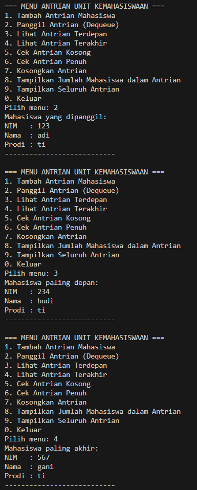
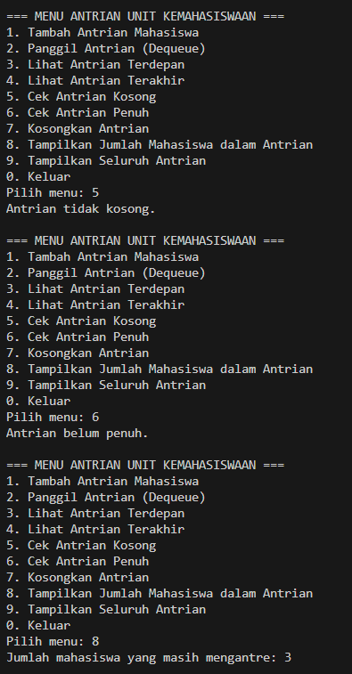
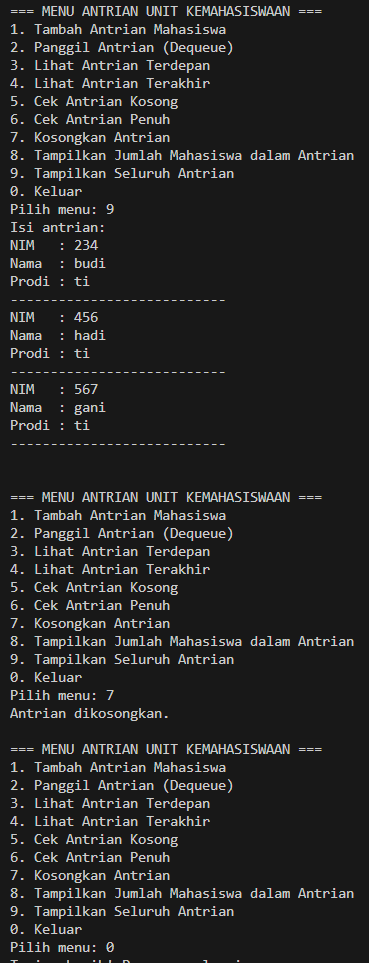

|  | Algorithm and Data Structure |
|--|--|
| NIM |   244107010045|
| Nama |  M.Adhitya Yusuf Al-Ayyubi |
| Kelas | TI - 1H |
| Repository | (https://github.com/Adhityayusuf/daspro-semester2/tree/main/pertemuan%2012)     

# PERTEMUAN KE DUA BELAS    

## Percobaan 1 : Pembuatan Single Linked List     

Hasil Percobaan :     
     

### PERTANYAAN :     
1. karena belum ada data yang ditambahkan melalui method `add` yang ada pada class `SingleLinkedList`       
2. Variabel temp digunakan sebagai pointer yang merujuk pada attribut `head` pada class `SingleLinkedList`, kegunaan umumnya untuk melakukan penelusuran data dengan memanfaatkan atribut `next` untuk mengakses node selanjutnya.      
3. Memodifikasi bagian main nya
```   
import java.util.Scanner;

public class SLLMain13 {
    public static void main(String[] args) {
        Scanner sc = new Scanner(System.in);
        SingleLinkedList13 sll = new SingleLinkedList13();

        System.out.print("Masukkan jumlah mahasiswa yang ingin ditambahkan: ");
        int jumlah = sc.nextInt();
        sc.nextLine(); // membersihkan newline

        for (int i = 0; i < jumlah; i++) {
            System.out.println("Mahasiswa ke-" + (i + 1));
            System.out.print("NIM   : ");
            String nim = sc.nextLine();
            System.out.print("Nama  : ");
            String nama = sc.nextLine();
            System.out.print("Kelas : ");
            String kelas = sc.nextLine();
            System.out.print("IPK   : ");
            double ipk = sc.nextDouble();
            sc.nextLine(); // membersihkan newline

            Mahasiswa13 mhs = new Mahasiswa13(nim, nama, kelas, ipk);

            System.out.print("Tambah di (1) Depan / (2) Belakang: ");
            int pilih = sc.nextInt();
            sc.nextLine(); // newline

            if (pilih == 1) {
                sll.addFirst(mhs);
            } else {
                sll.addLast(mhs);
            }

            sll.print();
        }

        sc.close();
    }
}
```     

## Percobaan 2 : Modifikasi Elemen pada Single Linked List       

Hasil Percobaan :      
     

### PERTANYAAN :       
1. keyword `break` pada method `remove` digunakan untuk keluar dari perulangan ketika salah satu dari kondisi tersebut sudah terpenuhi.   
2. Kode di atas merupakan proses memutus node setelah pointer `temp` dengan cara mengubah nilai attribut `next` menjadi objek setelah `temp.next`. Dan jika `temp.next` == `null` itu berarti data yang mau diubah berada pada posisi `tail` sehingga `tail` perlu diubah menjadi `temp` yang merupakan data sebelum `temp.next`.        

## TUGAS :    
Hasil tugas :       

     
     
     
       
