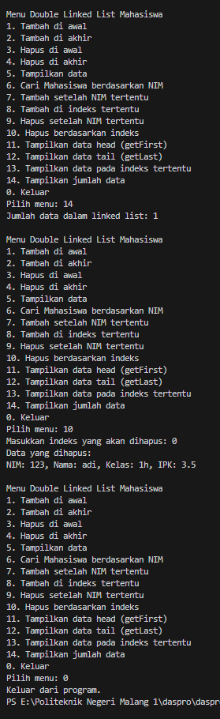

|  | Algorithm and Data Structure |
|--|--|
| NIM |   244107010045|
| Nama |  M.Adhitya Yusuf Al-Ayyubi |
| Kelas | TI - 1H |
| Repository | (https://github.com/Adhityayusuf/daspro-semester2/tree/main/pertemuan%2013)     

# PERTEMUAN KE TIGA BELAS    

## Percobaan 1 :      

Hasil Percobaan :     
       

### PERTANYAAN :
1. Single Linked List dan Double Linked List dibedakan dengan jumlah pointer yang ada di objek `Node`, seperti namanya Single Linked List hanya memiliki 1 attribute pointer yaitu `next` yang menandai objek setelah node itu sendiri sedangkan Double Linked List memiliki `prev` yang menandai objek sebelum node.

2. `next` berfungsi untuk menandai objek setelah node itu sendiri sedangkan `prev` berfungsi untuk menandai objek sebelum node. Keduanya merupakan pointer

3. konstruktor tersebut digunakan untuk menginisasi attribute `head` dan `tail` menjadi null, yang menandakan bahwa linked list tersebut masih kosong.

4. jika kondisi `isEmpty()` terpenuhi, attribute `head` dan `tail` akan langsung diisi dengan newNode, karena jika datanya hanya 1, otomatis value dari `head` dan `tail` akan sama

5. `head.prev` merupakan attribut pada node head (data pertama) yang menunjuk node sebelum data node tersebut, dengan statement tersebut, nilai dari `head.prev` akan diisi dengan `newNode` yang berarti `newNode` akan ditaruh di data paling depan.         

6. 
```
public void print() {
        if (isEmpty()) {
            System.out.println("Linked list masih kosong.");
        } else {
            System.out.println("Isi linked list:");
            Node13 current = head;
            while (current != null) {
                current.data.tampil();
                current = current.next;
            }
        }
    }
```          
7. `current.next.prev` = `newNode`, kode program ini berguna untuk mengisi attribut `prev` pada node setelah `current` sehingga menghubungkan data setelah `current` dengan `newNode`.         
8. 
```
System.out.println("7. Tambah setelah NIM tertentu");
```
```
case 7 -> {
    System.out.print("Masukkan NIM yang akan disisipi setelahnya: ");
    String key = scan.nextLine();
    Mahasiswa13 mhs = inputMahasiswa(scan);
    list.insertAfter(key, mhs);
}
```

## Percobaan 2 :          

Hasil Percobaan :          
       

### PERTANYAAN :
1. mengubah value dari attribute `head` menjadi node setelahnya yaitu dengan mengakses `head.next` dan mengubah value `head.prev` yang merupakan pointer ke node sebelumnya menjadi null.
2. 
```
public void removeFirst() {
        if (isEmpty()) {
            System.out.println("List kosong, tidak bisa dihapus.");
            return;
        }
        System.out.println("Data yang dihapus:");
        head.data.tampil();

        if (head == tail) {
            head = tail = null;
        } else {
            head = head.next;
            head.prev = null;
        }
    }

    public void removeLast() {
        if (isEmpty()) {
            System.out.println("List kosong, tidak bisa dihapus.");
            return;
        }
        System.out.println("Data yang dihapus:");
        tail.data.tampil();

        if (head == tail) {
            head = tail = null;
        } else {
            tail = tail.prev;
            tail.next = null;
        }
    }
```

## TUGAS :    
       
       
       