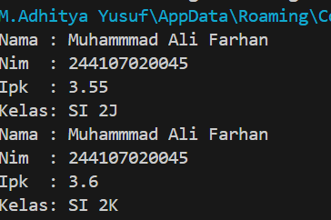
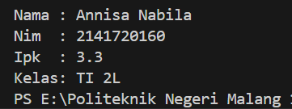
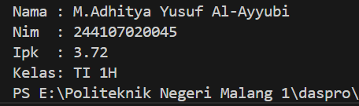
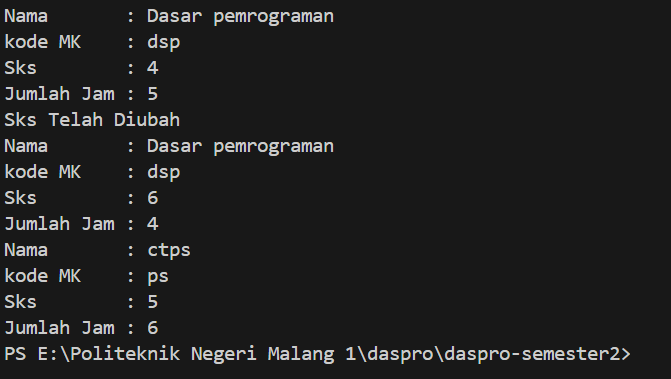

|  | Algorithm and Data Structure |
|--|--|
| NIM |   244107010045|
| Nama |  M.Adhitya Yusuf Al-Ayyubi |
| Kelas | TI - 1H |
| Repository | (https://github.com/Adhityayusuf/daspro-semester2/tree/main/pertemuan%202) |   

# PERTEMUAN KE DUA   

## Percobaan 1: Deklarasi Class, Atribut dan Method 

The solution is implemented in Mahasiswa13.java, and below is screenshot of the result.    

   

Kode di atas mendefinisikan **kelas `Mahasiswa13`** yang merepresentasikan data mahasiswa dengan atribut **nama, NIM, kelas, dan IPK**.  

Metode yang tersedia:  
- **`tampilkanInformasi()`** → Menampilkan data mahasiswa.  
- **`ubahKelas(String kelasBaru)`** → Mengubah kelas mahasiswa.  
- **`updateIpk(double ipkBaru)`** → Memperbarui IPK mahasiswa.  
- **`nilaiKinerja()`** → Mengembalikan kategori kinerja berdasarkan IPK.  

Program ini digunakan untuk menyimpan, mengubah, dan menampilkan informasi mahasiswa secara **berbasis objek**.     

### PERTANYAAN  
1. Sebutkan dua karakteristik class atau object !      
Dua karakteristik **class/object**:  
**Atribut** → Data yang dimiliki objek (contoh: `nama`, `nim`).   **Metode** → Fungsi yang dilakukan objek (contoh: `tampilkanInformasi()`).    
2. Perhatikan class Mahasiswa pada Praktikum 1 tersebut, ada berapa atribut yang dimiliki oleh class
Mahasiswa? Sebutkan apa saja atributnya !   
Ada 4 atribut, yaitu : `nama`, `nim`, `ipk`, `kelas`.    
3. Ada berapa method yang dimiliki oleh class tersebut? Sebutkan apa saja methodnya!    
ada 4 : `tampilkanInformasi`, `ubahKelas`, `updateIpk`, `nilaiKinerja`    
4. Modifikasi : 
```
if (ipk >= 0.0 && ipk <= 4.0) {
            ipk = ipkBaru;
        } else {
            System.out.println("IPK tidak valid. Harus antara 0.0 dan 4.0");
        }     
```
5. Method `nilaiKinerja()` mengevaluasi **IPK mahasiswa** dan mengembalikan **kategori kinerja** sebagai string:  
- **≥ 3.5** → "Sangat Baik"  
- **≥ 3.0** → "Baik"  
- **≥ 2.0** → "Cukup"  
- **< 2.0** → "Kurang"  
Menggunakan **percabangan `if-else`**, method ini **mengembalikan string** sesuai kategori IPK mahasiswa.      

## Percobaan 2: Instansiasi Object, serta Mengakses Atribut dan Method     

The solution is implemented in MahasiswaMain13.java, and below is screenshot of the result.       

     

Program ini mendemonstrasikan penggunaan **class `Mahasiswa13`** dengan objek `mhsl` untuk menyimpan dan mengubah informasi mahasiswa. Berikut alurnya:  

1. **Membuat objek `mhsl`** dari class `Mahasiswa13`.  
2. **Menginisialisasi atribut**:  
   - Nama: `"Muhammad Ali Farhan"`  
   - NIM: `"244107020045"`  
   - Kelas: `"SI 2J"`  
   - IPK: `3.55`  
3. **Menampilkan informasi awal** dengan method `tampilkanInformasi()`.  
4. **Mengubah kelas** menjadi `"SI 2K"` menggunakan `ubahKelas()`.  
5. **Memperbarui IPK** menjadi `3.60` dengan `updateIpk()`.  
6. **Menampilkan kembali informasi** setelah perubahan.    

### PERTANYAAN     
1. Pada class MahasiswaMain, tunjukkan baris kode program yang digunakan untuk proses 
instansiasi! Apa nama object yang dihasilkan?   
objeknya adalah mhs1
```
Mahasiswa13 mhsl = new Mahasiswa13();
```   
2. Di **Java**, atribut dan metode objek dapat diakses menggunakan **dot notation (`.`)**. Jika atribut bersifat `public`, Anda bisa langsung mengaksesnya dengan `obj.atribut`, tetapi jika `private`, gunakan **getter method** seperti `obj.getAtribut()`. Metode dipanggil dengan `obj.namaMethod()`.    
3. karena pada paggilan ke dua objek sudah diubah atau di modifikasi .     

## Percobaan 3: Membuat Konstruktor    

The solution is implemented in MahasiswaMain13.java, and below is screenshot of the result.    

``` 
public Mahasiswa13() {
    }
    public Mahasiswa13(String nm, String nim, double ipk, String kls) {
        nama = nm;
        this.nim = nim;
        this.ipk = ipk;
        kelas = kls;
    }
```
``` 
Mahasiswa13 mhs2 = new Mahasiswa13("Annisa Nabila","2141720160", 3.25,"TI 2L");
        mhs2.updateIpk(3.30);
        mhs2.tampilkanInformasi();
```  
     

pada kode program ini di tambah sebuah kontruktor lalu kode di panggil dengan cara menggunakan objek yg berparameter.   

### PERTANYAAN 
1. Pada class Mahasiswa di Percobaan 3, tunjukkan baris kode program yang digunakan untuk 
mendeklarasikan konstruktor berparameter!    
```
public Mahasiswa13(String nm, String nim, double ipk, String kls) {
        nama = nm;
        this.nim = nim;
        this.ipk = ipk;
        kelas = kls;
    }
```   
2. Melakukan hal berikut:  
**Membuat objek baru** dari class `Mahasiswa13` bernama `mhs2`.  
**Memanggil constructor berparameter**, yang menginisialisasi atribut objek dengan nilai:  
   - `nama = "Annisa Nabila"`  
   - `nim = "2141720160"`  
   - `ipk = 3.25`  
   - `kelas = "TI 2L"`  
Objek `mhs2` sekarang memiliki data yang dapat diakses dan dimodifikasi melalui method dalam class `Mahasiswa13`.
3. Maka akan error karena ada yg tidak menggunakan parameter.
4. Tidak , Method dalam class tidak memiliki urutan eksekusi yang wajib diikuti. Pemanggilan method dapat disesuaikan dengan kebutuhan program.   
5. Modifikasi :
```
Mahasiswa13 mhs13 = new Mahasiswa13("M.Adhitya Yusuf Al-Ayyubi","244107020045", 3.72, "TI 1H");
        mhs13.tampilkanInformasi();
```   
 

## LATIHAN 1   

Hasil latihan satu dari class MataKuliah13.java dan MataKuliahMain13.java :    

   

1. Class `MataKuliah13` merepresentasikan mata kuliah dengan atribut:  
- `kodeMk` (kode mata kuliah)  
- `nama` (nama mata kuliah)  
- `sks` (jumlah SKS)  
- `jumlahJam` (jumlah jam pertemuan)  
**Method dalam Class** :  
- **`tampilkanInformasi()`** → Menampilkan detail mata kuliah.  
- **`ubahSks(int sksBaru)`** → Mengubah jumlah SKS dan memberi pesan konfirmasi.  
- **`tambahJam(int jam)`** → Menambahkan jumlah jam pertemuan.  
- **`kurangiJam(int jam)`** → Mengurangi jumlah jam, tetapi hanya jika jumlah jam cukup.  
**kontruktor** :  
- **Default constructor** → Tidak menginisialisasi atribut.  
- **Parameterized constructor** → Menginisialisasi objek dengan nilai awal (`nama`, `kodeMk`, `sks`, `jumlahJam`).  
**Kesimpulan:**  
Class ini memungkinkan manipulasi data mata kuliah, seperti perubahan SKS dan jumlah jam kuliah, serta menampilkan informasi mata kuliah.   

2. **Penjelasan Program `MataKuliahMain13`**  
Program ini merupakan kelas main yang menjalankan class `MataKuliah13`.  
**Alur Program:**  
- **Membuat objek `mk1`** menggunakan **default constructor**, lalu mengisi atributnya secara manual.  
- **Menampilkan informasi `mk1`**, mengubah jumlah SKS, menambah dan mengurangi jam kuliah, lalu menampilkan kembali informasinya.  
- **Membuat objek `mk2`** menggunakan **constructor dengan parameter**, lalu langsung menampilkan informasinya.    

## LATIHAN 2   
