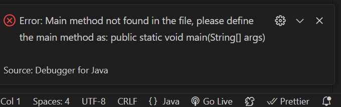

|  | Algorithm and Data Structure |
|--|--|
| NIM |   244107010045|
| Nama |  M.Adhitya Yusuf Al-Ayyubi |
| Kelas | TI - 1H |
| Repository | (https://github.com/Adhityayusuf/daspro-semester2/tree/main/pertemuan%202) |   

# PERTEMUAN KE DUA    

## Percobaan 1: Deklarasi Class, Atribut dan Method    

The solution is implemented in Mahasiswa13.java, and below is screenshot of the result.    

   

Kode di atas mendefinisikan **kelas `Mahasiswa13`** yang merepresentasikan data mahasiswa dengan atribut **nama, NIM, kelas, dan IPK**.  

Metode yang tersedia:  
- **`tampilkanInformasi()`** → Menampilkan data mahasiswa.  
- **`ubahKelas(String kelasBaru)`** → Mengubah kelas mahasiswa.  
- **`updateIpk(double ipkBaru)`** → Memperbarui IPK mahasiswa.  
- **`nilaiKinerja()`** → Mengembalikan kategori kinerja berdasarkan IPK.  

Program ini digunakan untuk menyimpan, mengubah, dan menampilkan informasi mahasiswa secara **berbasis objek**.     

### PERTANYAAN  
1. Sebutkan dua karakteristik class atau object !      
Dua karakteristik **class/object**:  
**Atribut** → Data yang dimiliki objek (contoh: `nama`, `nim`).   **Metode** → Fungsi yang dilakukan objek (contoh: `tampilkanInformasi()`).    
2. Perhatikan class Mahasiswa pada Praktikum 1 tersebut, ada berapa atribut yang dimiliki oleh class
Mahasiswa? Sebutkan apa saja atributnya !   
Ada 4 atribut, yaitu : `nama`, `nim`, `ipk`, `kelas`.    
3. 