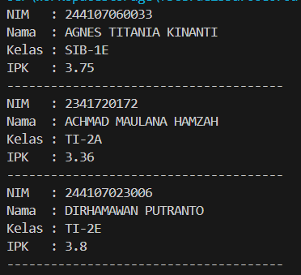
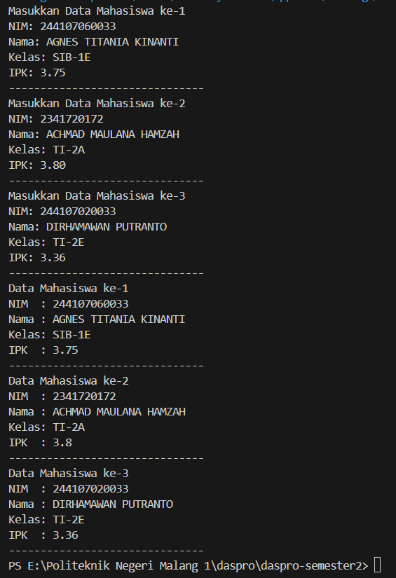
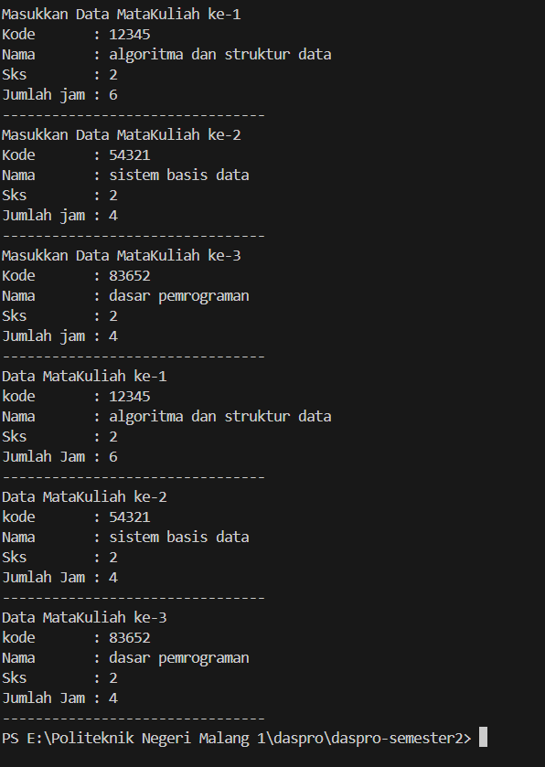
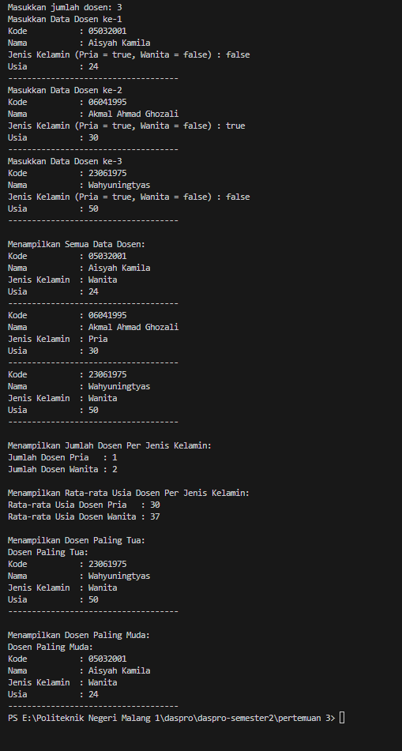

|  | Algorithm and Data Structure |
|--|--|
| NIM |   244107010045|
| Nama |  M.Adhitya Yusuf Al-Ayyubi |
| Kelas | TI - 1H |
| Repository | (https://github.com/Adhityayusuf/daspro-semester2/tree/main/pertemuan%203) |     

# PERTEMUAN KE TIGA     

## Percobaan 1 : Membuat Array dari Object, Mengisi dan Menampilkan     

The solution is implemented in Mahasiswa13.java and MahasiswaDemo13.java, and below is screenshot of the result.      

     

Alur dari program ini adalah :    
1. di pada class mahasiswademo melakukan pengisian array.  
2. lalu melakukan output pada pengisisn tadi.   

### PERTANYAAN :  
1. Tidak, sebuah class yang digunakan untuk membuat array of object tidak selalu harus memiliki atribut sekaligus method. karena Class yang digunakan untuk array of object tidak harus selalu memiliki method, cukup dengan atribut saja jika hanya berfungsi sebagai penyimpan data. Namun, jika diperlukan operasi tambahan seperti menampilkan atau memproses data, maka method dapat ditambahkan.     
2. Mendeklarasikan objek menjadi array.    
3. jika class mahasiswa tidak memiliki konstruktor maka java akan secara otomatis menyediakakn konstruktor defaut sendiri.    
4. mengisi array.  
5. karena class mahasiswa berguna untuk tempat array tersebut sedangkan mahasiswaDemo berguna untuk tempat menjalankan program tersebut.   

## Percobaan 2 : Menerima Input Isian Array Menggunakan Looping    

The solution is implemented in MahasiswaDemo13.java, and below is screenshot of the result.     

      

Program ini membuat array of object untuk menyimpan data 3 mahasiswa menggunakan class `Mahasiswa13`. Pada class `MahasiswaDemo13`, program:  

1. Menginisialisasi Scanner untuk input dan membuat array `Mahasiswa13[3]`.  
2. Menggunakan loop pertama untuk menginput NIM, Nama, Kelas, dan IPK ke dalam objek mahasiswa.  
3. Menggunakan loop kedua untuk menampilkan kembali data mahasiswa ke layar.  
4. IPK dikonversi dari String ke float untuk memastikan format numerik yang valid.   

### PERTANYAAN :   
1. 
```
public void cetakInfo() {
        System.out.println("NIM  : " + nim);
        System.out.println("Nama : " + nama);
        System.out.println("Kelas: " + kelas);
        System.out.println("IPK  : " + ipk);
        System.out.println("-------------------------------");
    }
```    
2. Kode tersebut menyebabkan error karena meskipun myArrayOfMahasiswa telah dialokasikan sebagai array dengan new Mahasiswa[3], elemen-elemen dalam array belum diinisialisasi dengan objek Mahasiswa.    

## Percobaan 3 :  Constructor Berparameter    

The solution is implemented in MataKuliah13.java and MataKuliahDemo13.java, and below is screenshot of the result.      

      

Program ini membuat array objek `Matakuliah` untuk menyimpan dan menampilkan data mata kuliah. Class `Matakuliah` memiliki atribut `kode`, `nama`, `sks`, dan `jumlahJam` dengan konstruktor untuk inisialisasi. Di `MatakuliahDemo`, array `arrayOfMatakuliah` dibuat untuk menampung 3 objek. Program meminta input pengguna dalam loop, menyimpannya dalam array, lalu menampilkan kembali data tersebut menggunakan loop kedua.    

### PERTANYAAN :     
1. Ya, suatu class dapat memiliki lebih dari satu constructor      
```
public class Mahasiswa {
    String nim;
    String nama;
    String kelas;
    
    public Mahasiswa() {
        this.nim = "000000";
        this.nama = "Default";
        this.kelas = "X";
    }
    
    public Mahasiswa(String nim, String nama) {
        this.nim = nim;
        this.nama = nama;
        this.kelas = "Belum ditentukan";
    }
    
    public Mahasiswa(String nim, String nama, String kelas) {
        this.nim = nim;
        this.nama = nama;
        this.kelas = kelas;
    }
    
    public void cetakInfo() {
        System.out.println("NIM   : " + nim);
        System.out.println("Nama  : " + nama);
        System.out.println("Kelas : " + kelas);
        System.out.println("----------------------");
    }
}

public class MahasiswaDemo {
    public static void main(String[] args) {
        Mahasiswa mhs1 = new Mahasiswa();
        Mahasiswa mhs2 = new Mahasiswa("2201001", "Agus");
        Mahasiswa mhs3 = new Mahasiswa("2201002", "Budi", "SI-1");
        
        mhs1.cetakInfo();
        mhs2.cetakInfo();
        mhs3.cetakInfo();
    }
}
```       
2. 
```
public void tambahData() {
        Scanner sc = new Scanner(System.in);
        String dummy;
        System.out.print("Kode       : ");
        kode = sc.nextLine();
        System.out.print("Nama       : ");
        nama = sc.nextLine();
        System.out.print("Sks        : ");
        dummy = sc.nextLine();
        sks = Integer.parseInt(dummy);
        System.out.print("Jumlah jam : ");
        dummy = sc.nextLine();
        jumlahJam = Integer.parseInt(dummy);
        System.out.println("--------------------------------");
    }
```     
```
for(int i = 0; i < n; i++) {
            System.out.println("Masukkan Data MataKuliah ke-" + (i+1));
            arrayOfMatakuliah13[i] = new Matakuliah13();
            arrayOfMatakuliah13[i].tambahData();
        }
```    
3. 
```
public void cetakInfo() {
        System.out.println("kode       : " + this.kode);
        System.out.println("Nama       : " + this.nama);
        System.out.println("Sks        : " + this.sks);
        System.out.println("Jumlah Jam : " + this.jumlahJam);
        System.out.println("--------------------------------");
    }
```     
```
for(int i = 0; i < n; i++) {
            System.out.println("Data MataKuliah ke-" + (i + 1));
            arrayOfMatakuliah13[i].cetakInfo();
        }
```    
4. 
```
int n;
System.out.print("Jumlah MataKuliah : ");
n = sc.nextInt();
```       
## TUGAS    

The solution is implemented in Dosen13.java, DosenDemo13.java,and DataDosen13.java, and below is screenshot of the result.    

     

**Ringkasan Langkah Kerja Program**  

1. Kelas `Dosen13` (Merepresentasikan dosen)  
    - Menyimpan data dosen (kode, nama, jenis kelamin, usia).  
    - Metode `tampilkanData()` menampilkan informasi dosen.  
2. Kelas `DataDosen13` (Analisis Data Dosen)  
Berisi metode untuk:  
    - Menampilkan semua data dosen.  
    - Menghitung jumlah dosen pria/wanita.  
    - Menghitung rata-rata usia berdasarkan jenis kelamin.  
    - Menentukan dosen tertua & termuda.  
3. Kelas `DosenDemo13` (Main Program)  
    - Menerima jumlah dosen & input data.  
    - Menyimpan data dalam array.  
    - Memanggil metode `DataDosen13` untuk menampilkan hasil analisis.  
    - Menutup scanner setelah selesai.  