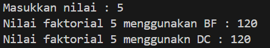

|  | Algorithm and Data Structure |
|--|--|
| NIM |   244107010045|
| Nama |  M.Adhitya Yusuf Al-Ayyubi |
| Kelas | TI - 1H |
| Repository | (https://github.com/Adhityayusuf/daspro-semester2/tree/main/pertemuan%205) |     

# PERTEMUAN KE LIMA     

## Percobaan 1 : Menghitung Nilai Faktorial dengan Algoritma Brute Force dan Divide and Conquer      

The solution is implemented in Faktorial13.java and MainFaktorial13.java, and below is screenshot of the result.     

    

Alur Program:
1. Input: Pengguna memasukkan bilangan nilai.   
2. BF Method (faktorialBF): Menggunakan perulangan for untuk menghitung faktorial.   
3. DC Method (faktorialDC): Menggunakan rekursi untuk menghitung faktorial.    
4. Output: Menampilkan hasil faktorial dari kedua metode.    

### PERTANYAAN :    
1. Dalam algoritma Divide and Conquer untuk faktorial, `if` digunakan sebagai base case untuk menghentikan rekursi saat `n == 1`, sedangkan `else` menjalankan rekursi dengan memecah faktorial menjadi `n * faktorialDC(n - 1)` hingga mencapai base case. Tanpa base case, rekursi akan terus berjalan tanpa henti.    
2. ya, menggunakan while :     
```
int faktorialBF(int n) {
    int fakto = 1, i = 1;
    do {
        fakto *= i;
        i++;
    } while (i <= n);
    return fakto;
}
```     
3. `fakto *= i;` digunakan dalam perulangan untuk menghitung faktorial secara bertahap sedangkan `int fakto = n * faktorialDC(n-1);` digunakan dalam rekursi untuk membagi masalah menjadi sub-masalah yang lebih kecil.     
4. Method `faktorialBF()` menggunakan perulangan untuk menghitung faktorial, di mana nilai faktorial diperbarui secara bertahap dalam setiap perulangan. Sebaliknya, `faktorialDC()` menggunakan rekursi (Divide & Conquer) dengan memecah masalah menjadi sub-masalah lebih kecil hingga mencapai base case (`n == 1`), lalu mengembalikan hasil secara berurutan.       

## Percobaan 2 : Menghitung Hasil Pangkat dengan Algoritma Brute Force dan Divide and Conquer       

The solution is implemented in Pangkat13.java and MainPangkat13.java, and below is screenshot of the result.     

      

Alur Program:
1. Input: Pengguna memasukkan jumlah elemen, lalu memasukkan basis dan pangkat untuk setiap elemen.    
2. BF Method (pangkatBF): Menggunakan perulangan untuk mengalikan basis sebanyak pangkatnya.     
3. DC Method (pangkatDC): Menggunakan rekursi, membagi pangkat menjadi lebih kecil hingga mencapai base case (n == 1).    
4. Output: Program mencetak hasil perpangkatan dari kedua metode.     

### PERTANYAAN : 
1. Method `pangkatBF()` menggunakan perulangan (`for`) untuk mengalikan basis `a` sebanyak `n` kali, sederhana tetapi lambat untuk pangkat besar. Sementara itu,`pangkatDC()` menggunakan rekursi (Divide & Conquer) dengan membagi pangkat menjadi lebih kecil (`n/2`), sehingga lebih cepat.     
2. ya, `return (pangkatDC(a, n/2)*pangkatDC(a, n/2)*a);` dan `return (pangkatDC(a, n/2)*pangkatDC(a, n/2));`.    
3. Ya, method bisa dibuat tanpa parameter dengan langsung menggunakan atribut nilai dan pangkat.       
```
int pangkatBF() {
    int hasil = 1;
    for (int i = 0; i < pangkat; i++) {
        hasil *= nilai;
    }
    return hasil;
}
```      
4. Method `pangkatBF()` menggunakan perulangan (`for`) untuk mengalikan basis `a` sebanyak `n` kali, sederhana tetapi lambat untuk pangkat besar. Sementara itu,`pangkatDC()` menggunakan rekursi (Divide & Conquer) dengan membagi pangkat menjadi lebih kecil (`n/2`), sehingga lebih cepat.      

## Percobaan 3 :  Menghitung Sum Array dengan Algoritma Brute Force dan Divide and Conquer     

The solution is implemented in Sum13.java and MainSum13.java, and below is screenshot of the result.      

      

Alur Program:     
1. Input: Pengguna memasukkan jumlah elemen keuntungan dan nilainya ke dalam array.     
2. Brute Force (totalBF()): Menjumlahkan elemen satu per satu dengan perulangan.     
3. Divide & Conquer (totalDC()): Membagi array secara rekursif hingga tersisa satu elemen, lalu menjumlahkan hasilnya.      
4. Output: Program mencetak total keuntungan dari kedua metode.    

### PERTANYAAN : 
1. Variable mid pada method totalDC() digunakan untuk membagi array menjadi dua bagian.    
2. Statement ini digunakan untuk memecah dan menyelesaikan masalah secara rekursif, mengikuti prinsip Divide & Conquer dengan cara membagi, menyelesaikan bagian kecil, lalu menggabungkan hasilnya.    
3. Untuk menggabungkan hasil dari dua bagian array yang telah diproses secara rekursif.     
4. 
```
if (l == r) {
    return arr[l];
}
```     
5. Kesimpulan `totalDC()`  
Metode `totalDC()` menggunakan Divide & Conquer dengan membagi array menjadi dua, menghitung total tiap bagian secara rekursif, lalu menggabungkan hasilnya (`lsum + rsum`). Base case terjadi saat hanya satu elemen tersisa.     

## TUGAS     

