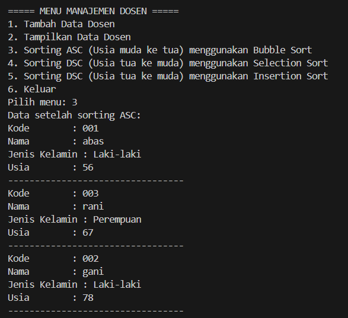

|  | Algorithm and Data Structure |
|--|--|
| NIM |   244107010045|
| Nama |  M.Adhitya Yusuf Al-Ayyubi |
| Kelas | TI - 1H |
| Repository | (https://github.com/Adhityayusuf/daspro-semester2/tree/main/pertemuan%206) |       

# PERTEMUAN KE ENAM      

## Percobaan 1 :  Mengimplementasikan Sorting menggunakan object     

The solution is implemented in Sorting13.java and SortingMain13.java, and below is screenshot of the result.     

      

Langkah-langkah Jalannya Program  

1. Inisialisasi Class `Sorting13`  
   - Menyimpan data dalam array.  
   - Menyediakan metode Bubble Sort, Selection Sort, Insertion Sort untuk pengurutan angka.  
   - Menampilkan data sebelum dan setelah sorting.  

2. Sorting dengan Bubble Sort  
   - Input: `{20, 10, 2, 7, 12}`  
   - Bubble Sort mengurutkan elemen secara bertahap dengan pertukaran berulang.  
   - Output: `{2, 7, 10, 12, 20}`  

3. Sorting dengan Selection Sort  
   - Input: `{30, 20, 2, 8, 14}`  
   - Selection Sort memilih elemen terkecil dan menempatkannya ke posisi yang benar.  
   - Output: `{2, 8, 14, 20, 30}`  

4. Sorting dengan Insertion Sort  
   - Input: `{40, 10, 4, 9, 3}`  
   - Insertion Sort menyisipkan elemen ke posisi yang tepat dalam urutan naik.  
   - Output: `{3, 4, 9, 10, 40}`     

### PERTANYAAN : 
1. Menukar dua elemen dalam array jika elemen sebelumnya lebih besar dari elemen saat ini.      
2. 
```
for (int j = i + 1; j < jumData; j++) {
                if(data[j] < data[min]) {
                    min = j;
                }
            }
```      
3. Untuk memastikan bahwa elemen yang lebih besar dari temp akan digeser ke kanan, hingga ditemukan posisi yang tepat untuk menyisipkan temp dalam urutan yang benar.       
4. Berfungsi untuk menggeser elemen yang lebih besar ke kanan agar tersedia ruang bagi elemen baru (temp) yang lebih kecil, sehingga array tetap terurut.     

## Percobaan 2 : Mengurutkan Data Mahasiswa Berdasarkan IPK (Bubble Sort)      

The solution is implemented in Mahasiswa13.java, MahasiswaDemo13.java, and MahasiswaBerprestasi13.java, and below is screenshot of the result.     

       
       

Langkah-Langkah Jalannya Program:

1. Kelas `Mahasiswa13`: 
   - Menyimpan data mahasiswa seperti NIM, Nama, Kelas, dan IPK.
   - Memiliki konstruktor default dan konstruktor berparameter untuk inisialisasi data.
   - Method `tampilInformasi()` untuk menampilkan data mahasiswa.

2. Kelas `MahasiswaBerprestasi13`:
   - Menyimpan data maksimal 5 mahasiswa dalam array `listMhs`.
   - Method `tambah()` untuk menambahkan mahasiswa ke array.
   - Method `tampil()` untuk menampilkan daftar mahasiswa.
   - Method `bubbleSort()` untuk mengurutkan mahasiswa berdasarkan IPK secara descending (terbesar ke terkecil).

3. Kelas `MahasiswaDemo13` :
   - Setiap data mahasiswa ditambahkan ke dalam array menggunakan method `tambah()`.
   - Menampilkan daftar mahasiswa sebelum sorting.
   - Melakukan sorting menggunakan metode Bubble Sort berdasarkan IP(dari tertinggi ke terendah).
   - Menampilkan kembali daftar mahasiswa setelah sorting.       

### PERTANYAAN :     
1. a. Karena Bubble Sort bekerja dengan membandingkan pasangan elemen yang berdekatan dan setiap iterasi akan menempatkan satu elemen terbesar ke posisi akhir.      
b. untuk memastikan bahwa elemen yang sudah diurutkan tidak dibandingkan lagi.      
c. Total tahap Bubble Sort yang ditempuh: 49 tahap.     
2.   
      
```
Scanner sc = new Scanner(System.in);
        MahasiswaBerprestasi13 list = new MahasiswaBerprestasi13();

        for (int i = 0; i < 5; i++) {
            System.out.println("Masukkan data mahasiswa ke-" + (i + 1) + ":");
            System.out.print("NIM   : ");
            String nim = sc.nextLine();
            System.out.print("Nama  : ");
            String nama = sc.nextLine();
            System.out.print("Kelas : ");
            String kelas = sc.nextLine();
            System.out.print("IPK   : ");
            double ipk = sc.nextDouble();
            sc.nextLine();

            Mahasiswa13 mhs = new Mahasiswa13(nim, nama, kelas, ipk);
            list.tambah(mhs);
        }
```     

## Percobaan 3 : Mengurutkan Data Mahasiswa Berdasarkan IPK (Selection Sort)      

The solution is implemented in Mahasiswa13.java, MahasiswaDemo13.java, and MahasiswaBerprestasi13.java, and below is screenshot of the result.     

       
     

Penjelasan Metode `selectionSort()`      
Metode ini mengurutkan array `listMhs` berdasarkan IPK secara ascending (dari kecil ke besar) menggunakan Selection Sort.
1. Loop utama → Menentukan posisi yang akan diisi dengan nilai terkecil.  
2. Mencari nilai minimum di sisa array dan menyimpan indeksnya (`idxMin`).  
3. Swap (tukar) elemen terkecil dengan elemen di posisi saat ini (`i`).  
4. Diulang hingga seluruh array terurut.    

### PERTANYAAN :     
1. Menemukan indeks elemen dengan nilai IPK terkecil dari posisi i ke akhir.     

## Percobaan ke 4 : Mengurutkan Data Mahasiswa Berdasarkan IPK Menggunakan Insertion Sort        

The solution is implemented in Mahasiswa13.java, MahasiswaDemo13.java, and MahasiswaBerprestasi13.java, and below is screenshot of the result.       

       
     

Penjelasan `insertionSort()`     
Metode ini mengurutkan `listMhs` berdasarkan IPK terkecil ke terbesar menggunakan Insertion Sort.  
Cara kerja:  
1. Mulai dari indeks ke-1.  
2. Simpan elemen saat ini (`temp`).  
3. Geser elemen-elemen yang lebih besar ke kanan.  
4. Sisipkan `temp` ke posisi yang benar.     

### PERTANYAAN :    
1. " > " di ubah menjadi " < "
```
while (j > 0 && listMhs[j-1].ipk < temp.ipk)
```    

## TUGAS :   

The solution is implemented in Dosen13.java, DataDosen13.java, and DosenMain13.java, and below is screenshot of the result.       




        

Langkah-langkah Jalannya Program  

1. Inisialisasi Data  
   - Membuat class `Dosen13` untuk menyimpan atribut dosen.  
   - `DataDosen13` digunakan untuk menyimpan, menampilkan, dan mengurutkan data dosen.  
   - `DosenMain13` sebagai program utama untuk mengelola input dan menampilkan menu.  

2. Menampilkan Menu  
   Program menampilkan menu pilihan:  
   - 1 = Tambah data dosen.  
   - 2 = Tampilkan daftar dosen.  
   - 3 = Sorting ASC (Bubble Sort).  
   - 4 = Sorting DSC (Selection Sort).  
   - 5 = Sorting DSC (Insertion Sort).  
   - 6 = Keluar dari program.  

3. Input Data Dosen  
   - User memasukkan kode, nama, jenis kelamin, dan usia dosen.  
   - Data disimpan dalam array `dataDosen`.  
   - Program menanyakan apakah ingin menambahkan data lagi.  

4. Menampilkan Data Dosen  
   - Jika ada data, akan ditampilkan menggunakan method `tampil()`.  
   - Jika tidak ada data, menampilkan pesan "Belum ada data dosen".  

5. Pengurutan Data Dosen  
   - Bubble Sort (ASC) = Mengurutkan usia dari muda ke tua.  
   - Selection Sort (DSC) = Mengurutkan usia dari tua ke muda.  
   - Insertion Sort (DSC) = Mengurutkan usia dari tua ke muda dengan cara penyisipan.  

6. Keluar dari Program  
   - Jika user memilih 6, program akan berhenti dengan pesan "Keluar dari program !!!".
