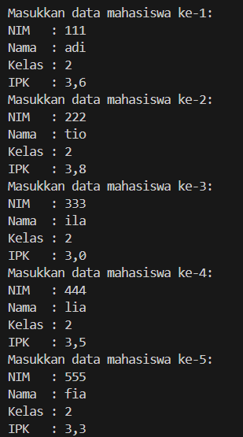

|  | Algorithm and Data Structure |
|--|--|
| NIM |   244107010045|
| Nama |  M.Adhitya Yusuf Al-Ayyubi |
| Kelas | TI - 1H |
| Repository | (https://github.com/Adhityayusuf/daspro-semester2/tree/main/pertemuan%207) |        

# PERTEMUAN KE TUJUH       

## Percobaan 1 : Searching / Pencarian Menggunakan Agoritma Sequential Search       

The solution is implemented in Mahasiswa13.java, MahasiswaDemo13.java, and MahasiswaBerprestasi13.java, and below is screenshot of the result.       

       
       

alur jalanya progeram : 
1. program meminta input ipk yang ingin di cari    
2. lalu ipk akan di cari menggunakan sequential search   
3. Jika ditemukan, method mengembalikan indeks mahasiswa tersebut. Jika tidak ditemukan, method mengembalikan -1.     
4. Method `tampilPosisi(double x, int pos)` menampilkan hasil pencarian: Jika ditemukan, program menampilkan indeksnya. Jika tidak ditemukan, program menampilkan pesan bahwa data tidak ada.     
5. Method `tampilDataSearch(double x, int pos)` menampilkan detail mahasiswa jika ditemukan. Jika ditemukan, program menampilkan detail mahasiswa seperti NIM, Nama, Kelas, dan IPK. Jika tidak ditemukan, program menampilkan pesan bahwa data tidak ditemukan.      

### PERTANYAAN :     
1. `tampilPosisi` hanya menunjukkan posisi indeks data. `tampilDataSearch` menampilkan detail lengkap mahasiswa.     
2. Menghentikan perulangan setelah menemukan data yang sesuai (IPK yang dicari).     

## Percobaan 2 : Searching / Pencarian Menggunakan Binary Search       

The solution is implemented in Mahasiswa13.java, MahasiswaDemo13.java, and MahasiswaBerprestasi13.java, and below is screenshot of the result.         

       
       

alur jalannya program :      
1. Program meminta pengguna memasukkan IPK mahasiswa yang ingin dicari.    
2. lalu ipk akan di cari menggunakan Binary search   
3. Jika ditemukan, fungsi mengembalikan indeks lokasi data dalam array. Jika tidak, mengembalikan -1.    
4. Menampilkan Hasil Pencarian :
    - Jika IPK ditemukan: `tampilPosisi(cari, pss2);` menampilkan posisi data di array.`tampilDataSearch(cari, pss2);` menampilkan detail mahasiswa (NIM, nama, kelas, IPK).
    - Jika tidak ditemukan, akan muncul pesan "Data tidak ditemukan".     

### PERTANYAAN :    
1. `int mid = (left + right) / 2;`     
2. 
```    
if (cari == listMhs[mid].ipk) {
                return (mid);
            }
```     
3. Tidak akan berjalan dengan benar, karena algoritma binary search hanya berlaku untuk data yang terurut.       
4. Tidak sesuai `else if (listMhs[mid].ipk < cari)`.      
5. 
```  
System.out.print("Masukkan jumlah mahasiswa: ");
        int jumMhs = sc.nextInt();
        sc.nextLine();
```     
`for (int i = 0; i < jumMhs; i++)`   

## TUGAS :     

The solution is implemented in Dosen13.java, DataDosen13.java, and DosenMain13.java, and below is screenshot of the result.       

       
       

Berikut Alur jalannya:

Potongan Program Pertama (Fungsi-fungsi pencarian dan tampilan):
1. `pencarianDataSequential13(String nama)`:
   - Fungsi ini mencari data dosen berdasarkan nama secara sequential. 
   - Looping dilakukan dari `i = 0` hingga `idx - 1`.
   - Jika ditemukan dosen dengan nama yang cocok (`dataDosen[i].nama.equalsIgnoreCase(nama)`), maka `jmlHasil` akan ditambah dan posisi (indeks) ditemukan akan dikembalikan.
   - Jika tidak ditemukan, fungsi mengembalikan nilai `-1`.
2. `pencarianDataBinary13(int cari, int left, int right)`:
   - Fungsi ini mencari data dosen berdasarkan usia menggunakan binary search.
   - Binary search hanya bisa dilakukan jika data sudah terurut.
   - Pada setiap langkah, menghitung posisi tengah (`mid`), dan membandingkan usia dosen pada posisi tengah dengan usia yang dicari (`cari`).
   - Jika ditemukan pada posisi tengah, fungsi mengembalikan indeksnya. Jika usia yang dicari lebih kecil atau lebih besar dari usia di tengah, pencarian dilanjutkan pada bagian kiri atau kanan dari array.

3. `tampilPosisi(String nama, int pos)`:
   - Fungsi ini menampilkan posisi dosen berdasarkan nama.
   - Jika posisi (`pos`) bukan `-1`, berarti data ditemukan dan ditampilkan posisinya.
   - Jika `pos` adalah `-1`, berarti data tidak ditemukan.

4. `tampilPosisi(int usia, int pos)`:
   - Fungsi ini menampilkan posisi dosen berdasarkan usia.
   - Sama seperti fungsi sebelumnya, menampilkan pesan posisi jika ditemukan atau pesan tidak ditemukan jika `pos` adalah `-1`.

5. `tampilDataSearch(String nama, int pos)`:
   - Fungsi ini menampilkan data dosen berdasarkan nama jika ditemukan.
   - Jika posisi (`pos`) bukan `-1`, data dosen ditampilkan menggunakan metode `tampil()`, dan jika ada lebih dari satu hasil pencarian, muncul peringatan bahwa ada lebih dari satu dosen dengan nama yang sama.
   - Jika posisi adalah `-1`, berarti data dosen dengan nama tersebut tidak ditemukan.

6. `tampilDataSearch(int usia, int pos)`:
   - Fungsi ini menampilkan data dosen berdasarkan usia dan posisi yang ditemukan.
   - Sama seperti fungsi sebelumnya, akan menampilkan data dosen atau pesan jika tidak ditemukan.

Potongan Program Kedua (Menu pilihan pengguna):
- `case 6`: Pencarian berdasarkan nama dosen secara sequential.
  1. Pengguna diminta untuk memasukkan nama dosen yang ingin dicari.
  2. Fungsi `pencarianDataSequential13` dipanggil untuk mencari dosen dengan nama yang dimasukkan.
  3. Setelah posisi ditemukan, fungsi `tampilPosisi` dan `tampilDataSearch` akan dipanggil untuk menampilkan hasil pencarian nama dosen tersebut.

- `case 7`: Pencarian berdasarkan usia dosen secara binary search.
  1. Pengguna diminta untuk memasukkan usia dosen yang ingin dicari.
  2. Sebelum melakukan pencarian binary, data dosen disortir terlebih dahulu menggunakan metode `sortingASC()`. Metode ini mengurutkan data dosen secara ascending berdasarkan usia.
  3. Fungsi `pencarianDataBinary13` dipanggil untuk mencari dosen berdasarkan usia yang dimasukkan, dengan menggunakan binary search.
  4. Setelah posisi ditemukan, fungsi `tampilPosisi` dan `tampilDataSearch` akan dipanggil untuk menampilkan hasil pencarian berdasarkan usia dosen.      